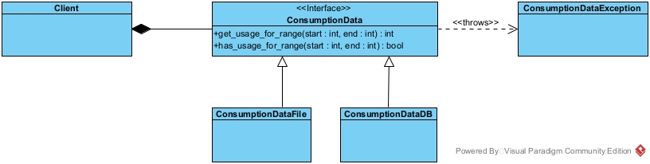

# Using an interface in team coding

Adam and I have decided to work on a piece of code together.  We want to build a simple system which draws a graph of some electricity consumption data.  We're going to divide the task into two whereby one of us builds the client that draws the graph, and the other loads the data from a source and provides the client a means to access that data.

We started with a whiteboard design session to agree the design of the interface class we would be using.  This establishes a contract that each of has to work to.

The client which draws the graph will call methods on an implementation of a `ConsumptionData` abstract class.  An abstract class is one which contains the concepts (i.e. the method) to be called, but doesn't actually implement them.

Later on we can implement concrete implementation classes.  The two examples on the screenshot above are `ConsumptionDataFile` and `ConsumptionDataDB`.  They should both exhibit the same behaviour to the client, but internally they will store / load the data in a different way.

There is a get_usage_for_range method which returns an integer containing the number of Watt hours (Wh) consumed during the specified range.  The dates are represented by unix timestamps.

We've agreed to use an Exception when the `get_usage_for_range` method cannot return valid data because:

* There is incomplete data for the input range (i.e. data is not available)
* The input range is invalid, e.g. the start date is after the end date.

The client can pro-actively check that it is providing valid data using the `has_usage_for_range` method which returns `True` or `False`.

To more formally document our initial design for the system, and in particular the interface, we also formalised our whiteboard notes as a [UML class diagram](https://www.visual-paradigm.com/guide/uml-unified-modeling-language/uml-class-diagram-tutorial/).

## Development Journal

In this section, we are just document what we are doing as we progress through the implementation so you can see the process from two perspectives.

### Front End (Simon)

First thing I have done is implemented a simple stubbed out version (`ConsumptionDataStub`) of the Back End so that I have something to code against.  I cannot wait until Adam has finished before starting what I am doing.  My stubbed out version doesn't have to be pretty, it just needs to return some kind of data so I can produce the graph.  For the moment I am simply returning random value between 10000 and 30000 Wh so I can create a graph in the client.

I've then added a Client jupyter notebook that sends a series of requests to the ConsumptionData instance to get a list of consumption values back which are subsequently plotted on a graph. At this stage, the data returned is all dummy data.

### Back End (Adam)

After we had agreed on the core design, I was able to start coding the abstract base class for the consumption data (`ConsumptionData`) whilst Simon completed the documentation of the contract for our interface. Simon was then able to work separately on the frontend whilst I worked on the backed because we had an established interface to code against.

To start developing for the backend I need to think about how I can read and process the data. I have created a skeleton of the `ConsumptionDataFile` class and will devise some unit tests to check that my implementation works as expected and per the contract we have agreed on.
